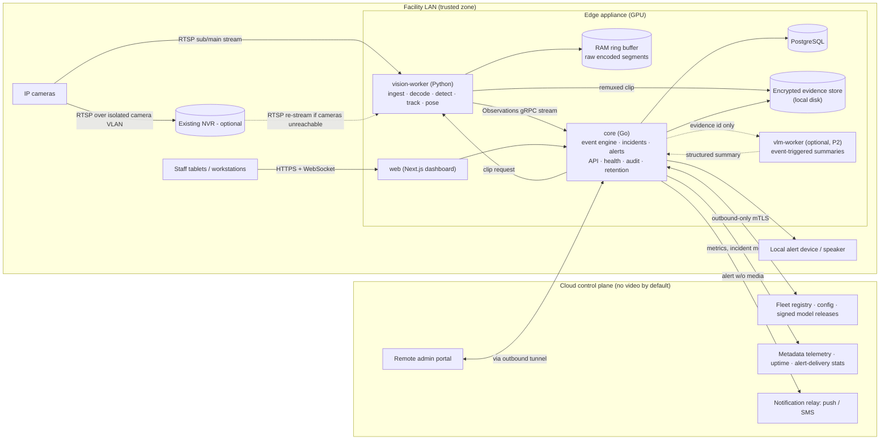

# 01-high-level

Source of truth: SYSTEM_ARCHITECTURE.md (kept in sync).

```mermaid
flowchart LR
  subgraph Facility["Facility LAN (trusted zone)"]
    CAM[IP cameras] -->|RTSP over isolated camera VLAN| NVR[(Existing NVR - optional)]
    CAM -->|RTSP sub/main stream| VW
    NVR -.->|RTSP re-stream if cameras unreachable| VW
    subgraph EDGE["Edge appliance (GPU)"]
      VW["vision-worker (Python)<br/>ingest · decode · detect · track · pose"]
      RB[("RAM ring buffer<br/>raw encoded segments")]
      CORE["core (Go)<br/>event engine · incidents · alerts<br/>API · health · audit · retention"]
      PG[(PostgreSQL)]
      EV[("Encrypted evidence store<br/>(local disk)")]
      WEB["web (Next.js dashboard)"]
      VLM["vlm-worker (optional, P2)<br/>event-triggered summaries"]
    end
    VW --> RB
    VW -->|Observations gRPC stream| CORE
    CORE -->|clip request| VW
    VW -->|remuxed clip| EV
    CORE --> PG
    CORE --> EV
    WEB --> CORE
    CORE -.->|evidence id only| VLM
    VLM -.->|structured summary| CORE
    STAFF[Staff tablets / workstations] -->|HTTPS + WebSocket| WEB
    CORE --> SIREN[Local alert device / speaker]
  end
  subgraph Cloud["Cloud control plane (no video by default)"]
    FLEET[Fleet registry · config · signed model releases]
    TELE[Metadata telemetry · uptime · alert-delivery stats]
    PUSH[Notification relay: push / SMS]
    RA[Remote admin portal]
  end
  CORE <-->|outbound-only mTLS| FLEET
  CORE -->|metrics, incident metadata| TELE
  CORE -->|alert w/o media| PUSH
  RA <-->|via outbound tunnel| CORE
```
