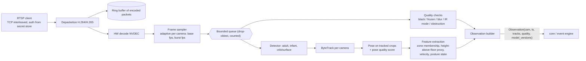

# 02-video-pipeline

Source of truth: SYSTEM_ARCHITECTURE.md (kept in sync).

```mermaid
flowchart LR
  A[RTSP client<br/>TCP interleaved, auth from secret store] --> B[Depacketize H.264/H.265]
  B --> RB[(Ring buffer of encoded packets)]
  B --> C[HW decode NVDEC]
  C --> D[Frame sampler<br/>adaptive per camera: base fps, burst fps]
  D --> Q{{"Bounded queue (drop-oldest, counted)"}}
  Q --> E[Quality checks<br/>black / frozen / blur / IR mode / obstruction]
  Q --> F[Detector: adult, infant, crib/surface]
  F --> G[ByteTrack per camera]
  G --> H[Pose on tracked crops<br/>+ pose quality score]
  H --> I[Feature extraction<br/>zone membership, height-above-floor proxy,<br/>velocity, posture state]
  E --> O[Observation builder]
  I --> O
  O -->|"Observation{cam, ts, tracks, quality, model_versions}"| CORE[core / event engine]
```
