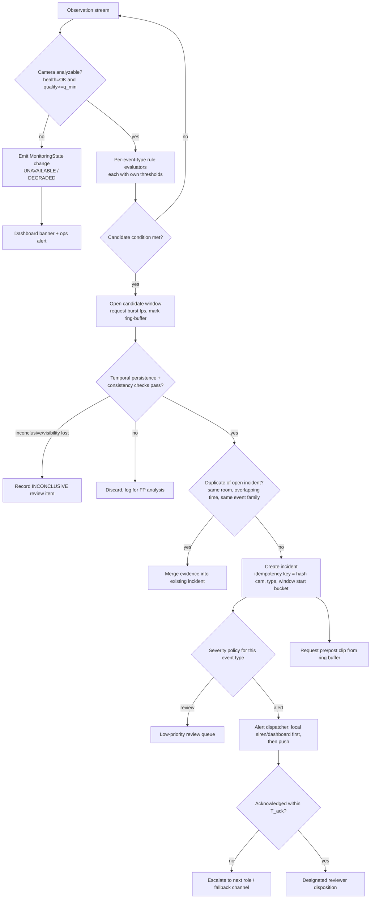

# 03-incident-decision-flow

Source of truth: SYSTEM_ARCHITECTURE.md (kept in sync).

```mermaid
flowchart TD
  O[Observation stream] --> V{Camera analyzable?<br/>health=OK and quality>=q_min}
  V -- no --> H[Emit MonitoringState change<br/>UNAVAILABLE / DEGRADED] --> UI[Dashboard banner + ops alert]
  V -- yes --> R[Per-event-type rule evaluators<br/>each with own thresholds]
  R --> C{Candidate condition met?}
  C -- no --> O
  C -- yes --> W[Open candidate window<br/>request burst fps, mark ring-buffer]
  W --> T{Temporal persistence +<br/>consistency checks pass?}
  T -- inconclusive/visibility lost --> INC[Record INCONCLUSIVE review item]
  T -- no --> X[Discard, log for FP analysis]
  T -- yes --> D{Duplicate of open incident?<br/>same room, overlapping time, same event family}
  D -- yes --> M[Merge evidence into existing incident]
  D -- no --> N[Create incident<br/>idempotency key = hash cam, type, window start bucket]
  N --> P{Severity policy for this event type}
  P -- review --> RQ[Low-priority review queue]
  P -- alert --> AL[Alert dispatcher: local siren/dashboard first,<br/>then push]
  AL --> ACK{Acknowledged within T_ack?}
  ACK -- no --> ESC[Escalate to next role / fallback channel]
  ACK -- yes --> REV[Designated reviewer disposition]
  N --> CLIP[Request pre/post clip from ring buffer]
```
