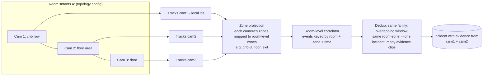

# 04-multi-camera

Source of truth: SYSTEM_ARCHITECTURE.md (kept in sync).

```mermaid
flowchart LR
  subgraph Room1["Room 'Infants A' (topology config)"]
    C1[Cam 1: crib row] --- C2[Cam 2: floor area]
    C2 --- C3[Cam 3: door]
  end
  C1 --> T1[Tracks cam1 - local ids]
  C2 --> T2[Tracks cam2]
  C3 --> T3[Tracks cam3]
  T1 & T2 & T3 --> Z[Zone projection<br/>each camera's zones mapped to room-level zones<br/>e.g. crib-3, floor, exit]
  Z --> CORR[Room-level correlator<br/>events keyed by room + zone + time]
  CORR --> DEDUP[Dedup: same family, overlapping window,<br/>same room-zone ⇒ one incident, many evidence clips]
  DEDUP --> INC[(Incident with evidence from cam1 + cam2)]
```
