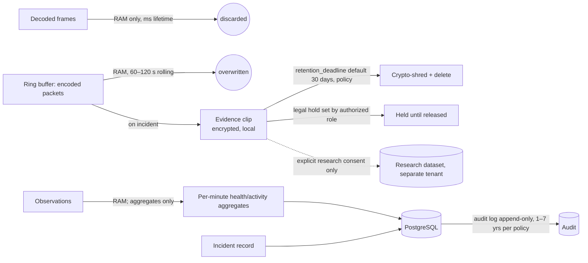

# 05-data-retention-lifecycle

Source of truth: SYSTEM_ARCHITECTURE.md (kept in sync).

```mermaid
flowchart LR
  F[Decoded frames] -->|RAM only, ms lifetime| X1((discarded))
  RB[Ring buffer: encoded packets] -->|RAM, 60–120 s rolling| X2((overwritten))
  RB -->|on incident| CLIP[Evidence clip<br/>encrypted, local]
  O[Observations] -->|RAM; aggregates only| AGG[Per-minute health/activity aggregates]
  AGG --> PG[(PostgreSQL)]
  INC[Incident record] --> PG
  CLIP -->|retention_deadline default 30 days, policy| DEL[Crypto-shred + delete]
  CLIP -->|legal hold set by authorized role| HOLD[Held until released]
  CLIP -.->|explicit research consent only| RES[(Research dataset, separate tenant)]
  PG -->|audit log append-only, 1–7 yrs per policy| AUD[(Audit)]
```
