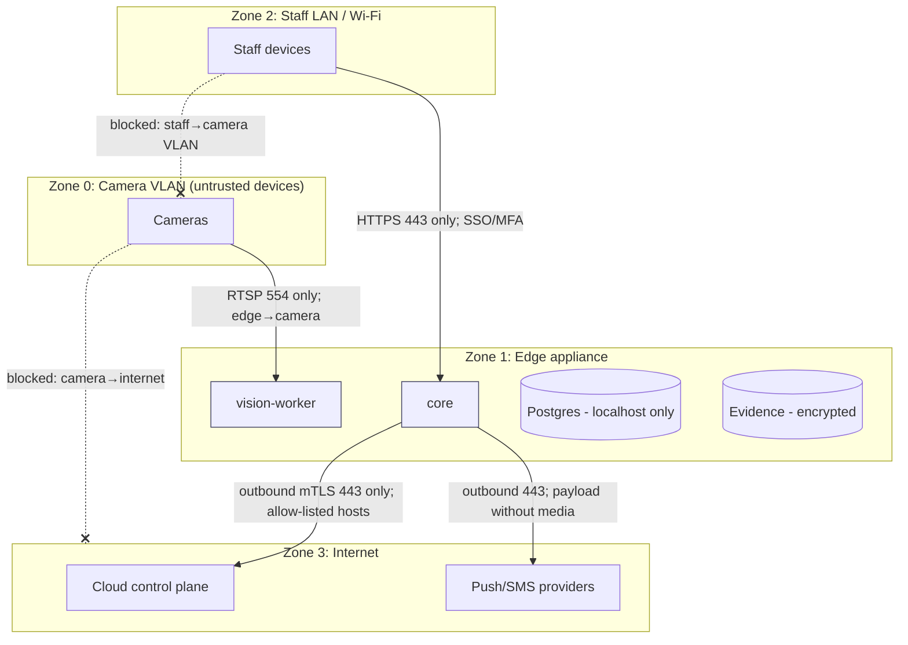

# 06-network-security-boundaries

Source of truth: SYSTEM_ARCHITECTURE.md (kept in sync).

```mermaid
flowchart TB
  subgraph Z0["Zone 0: Camera VLAN (untrusted devices)"]
    CAM[Cameras]
  end
  subgraph Z1["Zone 1: Edge appliance"]
    VW[vision-worker]:::svc
    CORE[core]:::svc
    PG[(Postgres - localhost only)]
    EV[(Evidence - encrypted)]
  end
  subgraph Z2["Zone 2: Staff LAN / Wi-Fi"]
    TAB[Staff devices]
  end
  subgraph Z3["Zone 3: Internet"]
    CP[Cloud control plane]
    PUSH[Push/SMS providers]
  end
  CAM -- "RTSP 554 only; edge→camera" --> VW
  TAB -- "HTTPS 443 only; SSO/MFA" --> CORE
  CORE -- "outbound mTLS 443 only; allow-listed hosts" --> CP
  CORE -- "outbound 443; payload without media" --> PUSH
  CAM -. "blocked: camera→internet" .-x Z3
  TAB -. "blocked: staff→camera VLAN" .-x CAM
  classDef svc fill:#eef,stroke:#446;
```
