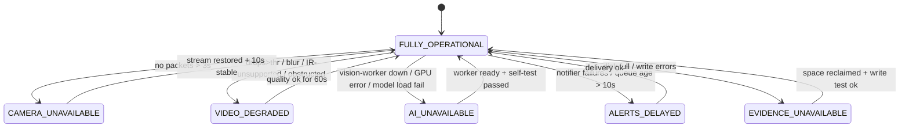

# 07-failure-degraded-states

Source of truth: SYSTEM_ARCHITECTURE.md (kept in sync).

```mermaid
stateDiagram-v2
  [*] --> FULLY_OPERATIONAL
  FULLY_OPERATIONAL --> CAMERA_UNAVAILABLE: no packets > 3s
  FULLY_OPERATIONAL --> VIDEO_DEGRADED: drops>thr / blur / IR-unsupported / obstructed
  FULLY_OPERATIONAL --> AI_UNAVAILABLE: vision-worker down / GPU error / model load fail
  FULLY_OPERATIONAL --> ALERTS_DELAYED: notifier failures / queue age > 10s
  FULLY_OPERATIONAL --> EVIDENCE_UNAVAILABLE: disk full / write errors
  CAMERA_UNAVAILABLE --> FULLY_OPERATIONAL: stream restored + 10s stable
  VIDEO_DEGRADED --> FULLY_OPERATIONAL: quality ok for 60s
  AI_UNAVAILABLE --> FULLY_OPERATIONAL: worker ready + self-test passed
  ALERTS_DELAYED --> FULLY_OPERATIONAL: delivery ok
  EVIDENCE_UNAVAILABLE --> FULLY_OPERATIONAL: space reclaimed + write test ok
```
