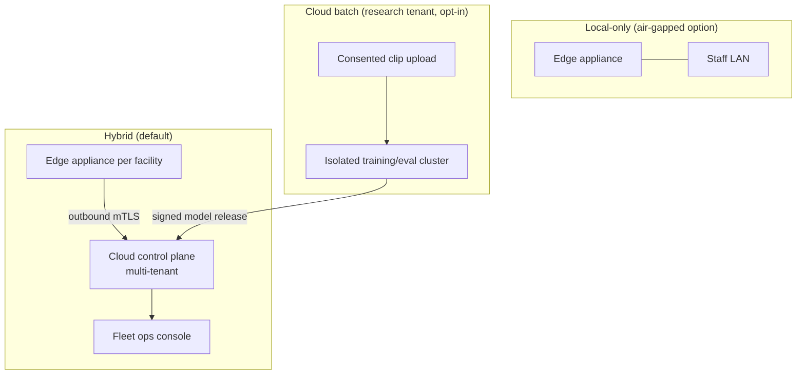

# 08-deployment-topologies

Source of truth: SYSTEM_ARCHITECTURE.md (kept in sync).

```mermaid
flowchart TB
  subgraph Local["Local-only (air-gapped option)"]
    L1[Edge appliance] --- L2[Staff LAN]
  end
  subgraph Hybrid["Hybrid (default)"]
    H1[Edge appliance per facility] -->|outbound mTLS| H2[Cloud control plane<br/>multi-tenant]
    H2 --> H3[Fleet ops console]
  end
  subgraph CloudBatch["Cloud batch (research tenant, opt-in)"]
    B1[Consented clip upload] --> B2[Isolated training/eval cluster]
    B2 -->|signed model release| H2
  end
```
