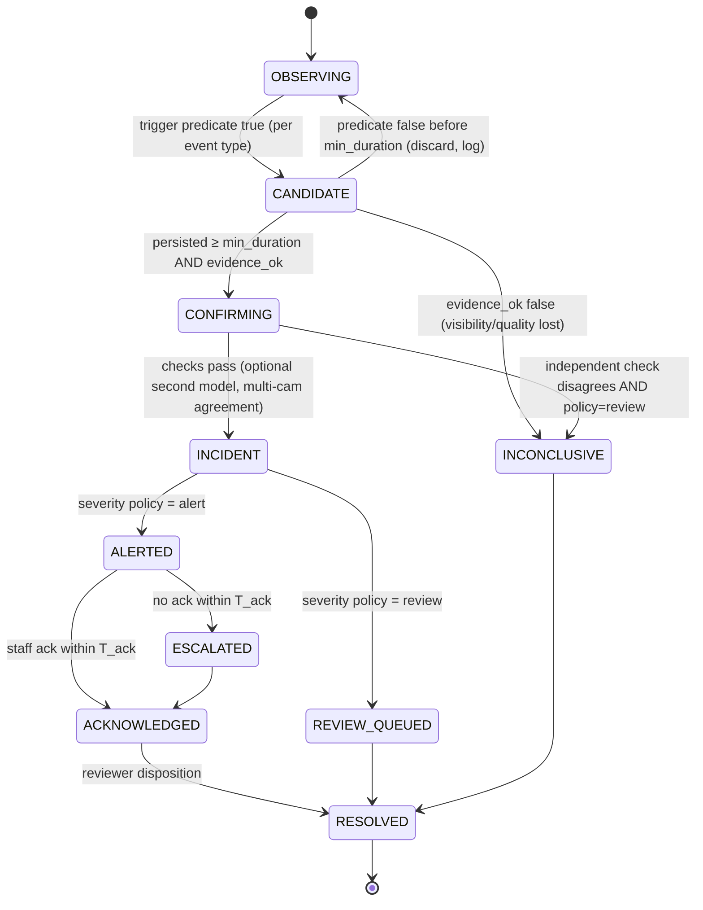

# 09-decision-engine-states

Source of truth: AI_MODEL_STRATEGY.md §7.

```mermaid
stateDiagram-v2
  [*] --> OBSERVING
  OBSERVING --> CANDIDATE: trigger predicate true (per event type)
  CANDIDATE --> OBSERVING: predicate false before min_duration (discard, log)
  CANDIDATE --> CONFIRMING: persisted ≥ min_duration AND evidence_ok
  CANDIDATE --> INCONCLUSIVE: evidence_ok false (visibility/quality lost)
  CONFIRMING --> INCONCLUSIVE: independent check disagrees AND policy=review
  CONFIRMING --> INCIDENT: checks pass (optional second model, multi-cam agreement)
  INCIDENT --> ALERTED: severity policy = alert
  INCIDENT --> REVIEW_QUEUED: severity policy = review
  ALERTED --> ACKNOWLEDGED: staff ack within T_ack
  ALERTED --> ESCALATED: no ack within T_ack
  ESCALATED --> ACKNOWLEDGED
  ACKNOWLEDGED --> RESOLVED: reviewer disposition
  REVIEW_QUEUED --> RESOLVED
  INCONCLUSIVE --> RESOLVED
  RESOLVED --> [*]
```
